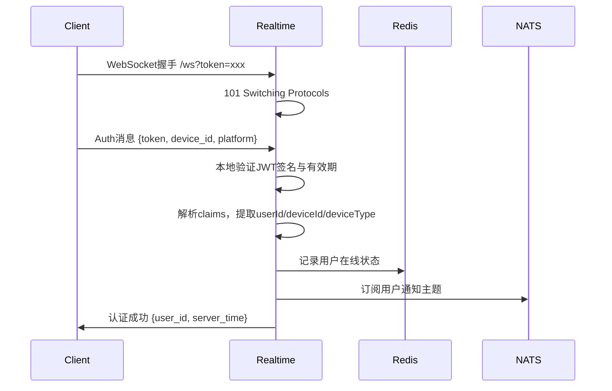
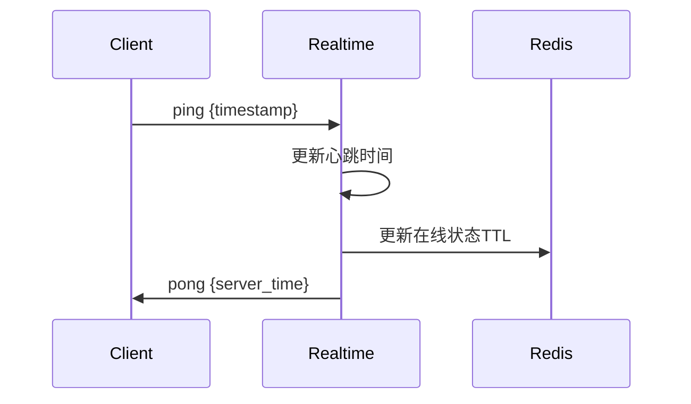

# WebSocket连接协议设计

## 1. 概述

Realtime Service负责WebSocket连接管理、消息实时推送、在线状态维护。

## 2. 功能列表

- [x] WebSocket连接建立
- [x] 连接认证
- [x] 心跳保活
- [x] 消息推送
- [x] 在线状态管理

## 3. 业务流程

### 3.1 连接建立

```mermaid
sequenceDiagram
    participant Client
    participant Realtime
    participant Redis
    participant NATS

    Client->>Realtime: WebSocket握手 /ws?token=xxx
    Realtime->>Realtime: 101 Switching Protocols
    Client->>Realtime: Auth消息 {token, device_id, platform}
    Realtime->>Realtime: 本地验证JWT签名与有效期
    Realtime->>Realtime: 解析claims，提取userId/deviceId/deviceType
    Realtime->>Redis: 记录用户在线状态
    Realtime->>NATS: 订阅用户通知主题
    Realtime->>Client: 认证成功 {user_id, server_time}
```

### 3.2 心跳保活

```mermaid
sequenceDiagram
    participant Client
    participant Realtime
    participant Redis

    Client->>Realtime: ping {timestamp}
    Realtime->>Realtime: 更新心跳时间
    Realtime->>Redis: 更新在线状态TTL
    Realtime->>Client: pong {server_time}
```
